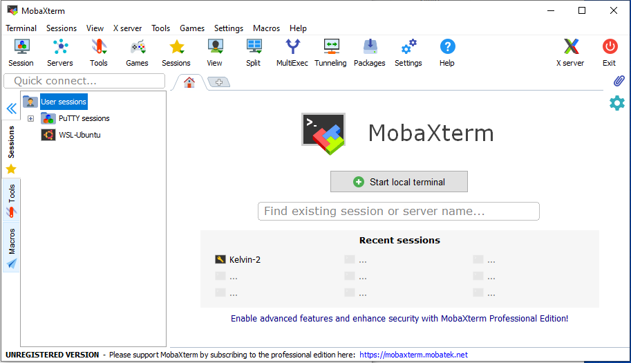
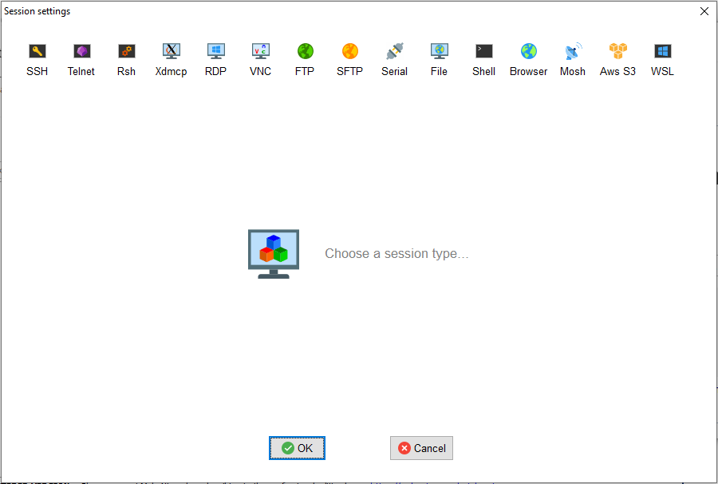
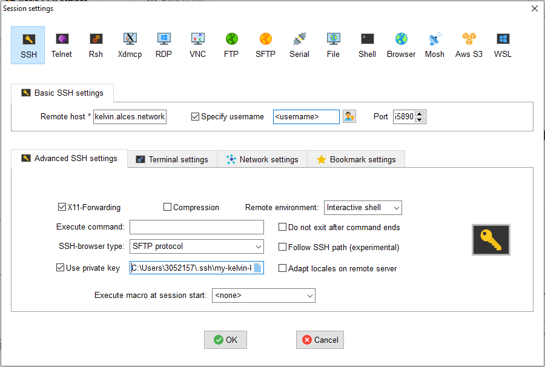
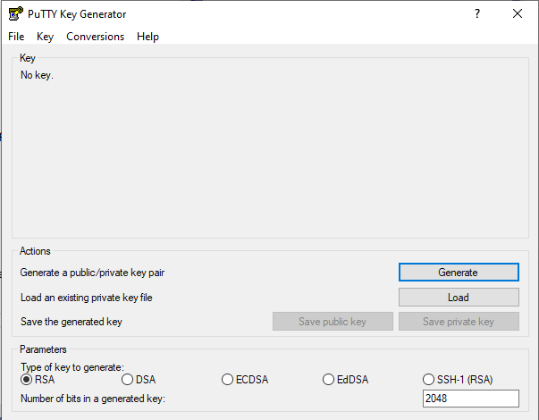

# Connecting to Kelvin2

## Applying for a Kelvin2 account

Complete the application form [on our website](https://www.ni-hpc.ac.uk/Access/){target=_blank} to apply for an account on Kelvin2. Please allow 48 hours for your application to be processed. If your request is successful, you will receive confirmation via email along with your account credentials.

## Connecting to Kelvin2 using the terminal
Connecting to Kelvin2 is done via Secure Shell Protocol (SSH) using either the terminal (command prompt) that comes preinstalled with your operating system or a separate SSH client which offers additional features, such as [PuTTY](https://www.chiark.greenend.org.uk/~sgtatham/putty/latest.html){target=_blank} or [MobaXterm](https://mobaxterm.mobatek.net/){target=_blank}. This section shows you how to connect to Kelvin2 using the terminal.

!!! note

    Older versions of Windows, pre Windows 10 (Autumn 2018), do not have OpenSSH installed as standard for use in their Command Prompt or PowerShell. In this case a separate SSH client such as PuTTY or MobaXterm is recommended.

There are two ways to connect to Kelvin2 depending on whether you are inside or outside the QUB network.

### Access from inside the QUB network
If you are a QUB user **and** you are connecting from inside the QUB network (either from being on premises or using VPN/Remote Desktop):

- Enter the following command into your terminal. **`<username>` is your QUB staff or student number**:
  ```bash
  ssh <username>@kelvin2.qub.ac.uk
  ```
- Enter your password when requested. **This is the same password associated with your QUB Active Directory.**
- If you have enabled multi-factor authentication (MFA), enter the verification code provided by your authenticator app when requested.

!!! warning

    It will soon become mandatory to have MFA enabled on your Kelvin2 account. To set up MFA, follow the instructions provided [further down this page](#multi-factor-authentication-mfa-on-kelvin2).

### Access from outside the QUB network

If you are outside the QUB network you can only connect to Kelvin2 using an SSH key pair. This steps required are as follows:

1. Generate an SSH key pair (and passphrase) on your machine
1. Copy the public SSH key to Kelvin2.
1. Connect to Kelvin2 using the SSH key and passphrase

Steps 1 and 2 will only need to be completed once.

**1. Generate an SSH Key Pair**

The procedure for generating an SSH key pair on your terminal varies depending on your operating system. Expand the relevant option below:

??? note "Mac/Linux"

    Create the SSH key pair on your machine by entering the following command into your terminal:
    ```bash
    ssh-keygen -t rsa -f ~/.ssh/my-kelvin-key
    ```
    **All users MUST set a passphrase when prompted.**

    This will create the SSH key pair in your .ssh directory. This key pair consists of a private key `my-kelvin-key` and a public key `my-kelvin-key.pub`

    It is the contents of the **public** key that you will want to transfer to Kelvin2. To display the contents of this file in the terminal, enter the following command:
    ```bash
    cat ~/.ssh/my-kelvin-key.pub
    ```

    **The private key should be kept safe and should not be shared with anybody.**

Please see our [video on how to set up remote access via Mac.](https://www.youtube.com/watch?v=DDSMemeVMv4&t=4s)

??? note "Windows 10 (Autumn 2018) or later"

    Create the SSH key pair on your machine by entering the following command into your terminal:
    ```bash
    ssh-keygen
    ```
    Call the key `my-kelvin-key` and optionally specify the full path that you want to save it to. The default location, if none is specified, is your home directory, e.g. `C:\Users\<username>\my-kelvin-key`.

    **All users MUST set a passphrase when prompted.**

    This will create the SSH key pair in the directory you have specified. This key pair consists of a private key `my-kelvin-key` and a public key `my-kelvin-key.pub`

    It is the contents of the **public** key that you will want to transfer to Kelvin2. To display the contents of this file in the terminal, enter the following command: 

    ```bash
    type my-kelvin-key.pub
    ```
    **The private key should be kept safe and should not be shared with anybody.**

??? note "Older versions of Windows"

    Older versions of Windows do not have a built in SSH client and you will have to install one separately. Two popular choices are 
    [PuTTY](https://www.chiark.greenend.org.uk/~sgtatham/putty/latest.html) 
    and [MobaXterm](https://mobaxterm.mobatek.net/) which have graphical tools to generate SSH keys called PuTTYgen and MobaKeyGen, respectively.

**2. Copy the Public SSH Key to Kelvin2**

If you are able to connect to Kelvin2 from inside the QUB network, but want to access from outside the network in future, then you are able to add the public key yourself. If you are outside the QUB network and therefore do not have access to Kelvin2,  [send your public key to us](https://www.ni-hpc.ac.uk/contact/){target=_blank}, and an administrator will add it for you.

To add your public key from inside the QUB network:

- Log into Kelvin2 using your QUB Active Directory credentials.

- Type the following command into your terminal on Kelvin2 to open the `authorized_keys` file using the vim text editor. 
  ```bash
  vi ~/.ssh/authorized_keys
  ```
- Once vim has opened, navigate to the end of the file and access "Insert Mode" by pressing Shift+G then Shift+A. The public SSH key already listed in the `authorized_keys` file labeled 'Alces Clusterware HPC Cluster Key' should not be modified or deleted.
- Press 'Enter' to create a new line
- On your local computer, copy the contents of `my-kelvin-key.pub` to the clipboard
- Paste this to the end of your `authorized_keys` file in Kelvin2 by right-clicking in the vim editor
- Press Esc to re-enter "Normal Mode"
- Save the file and exit the vim editor by typing the following command and press 'Enter'.
  ```vim
  :wq
  ```

**3. Connect to Kelvin2 using the SSH Key**

After this initial set-up process is complete, you can connect to Kelvin2 as follows:

- Enter the following command into your terminal. **For QUB users, `<username>` will be your staff or student number. For UU/EPSRC users, `<username>` will typically be your first initial and surname.**
  ```bash
  ssh -p 55890 -i /path/to/ssh/private/key <username>@login.kelvin.alces.network
  ```
- Enter your passphrase when requested. **This is the passphrase that you set up when creating the SSH key pair.**
- Enter the verification code provided by your authenticator app when requested. If you have not yet set up MFA, follow the instructions provided [in the following section](#multi-factor-authentication-mfa-on-kelvin2)


### Multi-Factor Authentication (MFA) on Kelvin2

To enhance the security of your Kelvin2 account, you are now requested to enable Multi-Factor Authentication (MFA). This involves a one-time activation process and then entering the verification code provided by your authenticator application on your mobile device (e.g. Microsoft Authenticator) every time you connect.

Multi-Factor Authentication prompts are currently mandatory for connections via port 55890 (i.e. connections from outside the QUB network, via ssh key) and will soon be enabled for connections via port 22 (i.e. connections from inside the QUB network, via QUB Active Directory credentials)


#### Enabling Multi-Factor Authentication

QUB Staff/Students are currently able to self-activate Multi-Factor Authentication (MFA) while on the QUB network. Otherwise, please [contact us](https://www.ni-hpc.ac.uk/contact/){target=_blank} and an administrator will arrange a Teams call with you to activate MFA on your behalf.

To self-activate Multi-Factor Authentication (MFA):

  - Log into Kelvin2 and type the following command into your terminal to generate a QR Code and key
    ```bash
    /opt/flight/bin/flight mfa generate
    ```
  - Using the authenticator application on your mobile device, scan the QR code or enter the key
  - Your authenticator should now be generating one-time passwords to access Kelvin2

!!! info

    If you lose access to your authenticator application and can no longer connect to Kelvin2, [contact us](https://www.ni-hpc.ac.uk/contact/){target=_blank} and an administrator will reset your MFA settings.


### Warnings when reconnecting to Kelvin2
When connecting to Kelvin2 you will be directed to one of four login nodes. Depending on your local settings, you may receive a warning on your terminal when you are directed to a login node that you have not connected to before:
```
@@@@@@@@@@@@@@@@@@@@@@@@@@@@@@@@@@@@@@@@@@@@@@@@@@@@@@@@@@@
@       WARNING: POSSIBLE DNS SPOOFING DETECTED!          @
@@@@@@@@@@@@@@@@@@@@@@@@@@@@@@@@@@@@@@@@@@@@@@@@@@@@@@@@@@@
The ECDSA host key for kelvin2.qub.ac.uk has changed,
and the key for the corresponding IP address 143.117.27.19
is unknown. This could either mean that
DNS SPOOFING is happening or the IP address for the host
and its host key have changed at the same time.
@@@@@@@@@@@@@@@@@@@@@@@@@@@@@@@@@@@@@@@@@@@@@@@@@@@@@@@@@@@
@    WARNING: REMOTE HOST IDENTIFICATION HAS CHANGED!     @
@@@@@@@@@@@@@@@@@@@@@@@@@@@@@@@@@@@@@@@@@@@@@@@@@@@@@@@@@@@
IT IS POSSIBLE THAT SOMEONE IS DOING SOMETHING NASTY!
Someone could be eavesdropping on you right now (man-in-the-middle attack)!
It is also possible that a host key has just been changed.
```
To prevent this warning, navigate to the `known_hosts` file on your local computer (default for linux is `~/.ssh/known_hosts` and paste the following four lines:
```
kelvin2.qub.ac.uk,143.117.27.19 ecdsa-sha2-nistp256 AAAAE2VjZHNhLXNoYTItbmlzdHAyNTYAAAAIbmlzdHAyNTYAAABBBH1T8XlKSmbuHOn0eEIVHfrvzYDBm0G6i2ansLID5XKtedN3OoxU/PqL6glR9pHhN5TinVgOsYYjX+YxlULwoxs=
kelvin2.qub.ac.uk,143.117.27.20 ecdsa-sha2-nistp256 AAAAE2VjZHNhLXNoYTItbmlzdHAyNTYAAAAIbmlzdHAyNTYAAABBBLNqmr6N1XCVdDlkvnI+qxO8QMPsyYPk3zd/CmgKDdgDgdn7rCpJRR3qBuiRjTM0Ok/GWzYk/h8Axaba0CVpv30=
kelvin2.qub.ac.uk,143.117.27.21 ecdsa-sha2-nistp256 AAAAE2VjZHNhLXNoYTItbmlzdHAyNTYAAAAIbmlzdHAyNTYAAABBBAHWMgZWOmETQjmych3RrxMyVcQgtVa1ndkrFbUpiFiP7aiZoVAcacyoGImJWMjKCU+ihkTtREXDz4EDDrMEce4=
kelvin2.qub.ac.uk,143.117.27.22 ecdsa-sha2-nistp256 AAAAE2VjZHNhLXNoYTItbmlzdHAyNTYAAAAIbmlzdHAyNTYAAABBBNQm41eL7A0QoTt9nwMz6gPZxw1L0i379r6f8lNQczoSQuLG9yp1M6ei7S0L6VwquBRkIMdmHzF4HtXmt33wy4k=
```

## Connecting to Kelvin2 using SSH clients

For Windows users, the recommended way to connect to Kelvin-2 is via a SSH client. The two most popular options are MobaXterm and PuTTY.

### MobaXterm

[MobaXterm](https://mobaxterm.mobatek.net) is a highly recommended SSH client for Windows. After installing and opening this program, follow these steps to configure the remote session:

1. On the initial screen, click "Session" on the ribbon at the top left of the screen.

    

1. On the "Sessions" screen, click on "SSH".

    

1. On the "SSH" screen, fill the following fields:
    - Remote host: `kelvin2.qub.ac.uk` from inside the QUB network, or `login.kelvin.alces.network` from outside the QUB network.
    - Tick "Specify username", and fill the box with your Kelvin-2 username.
    - Port: `22` from inside the QUB network, or `55890` from outside the QUB network.

    

1. Click on "Advanced SSH settings" screen and fill the following fields:

    - Tick "X11-Forwarding". This will allow to open graphical applications.
    - For the "SSH-browser type", select "SCP (Enhanced Speed)"
    - Only if you are connecting from ouside the QUB campus, tick "Use private key". Then click on the document icon on the right of the box, and select your private key file `my-kelvin-key`.
    - Click the "OK" box on the bottom of the Window.

    The session will be stored for future use, and it will appear on the left part of the initial MobaXTerm window, under the tab "Sessions". To connect again, just click on the session.

    

!!! note
    If MFA is enabled and "SSH-browser type" is set to SFTP you will be receive a verification prompt at every file transfer. For this reason, we recommend setting your "SSH-browser" type to SCP (Enhanced Speed)

### PuTTY
 
PuTTY can be installed from the Microsoft store, or 
[downloaded from the web](https://www.chiark.greenend.org.uk/~sgtatham/putty/latest.html){target=_blank}.

To use PuTTy as a remote SSH client, the configuration is similar to MobaXterm. To begin, you will need to configure a session:

If you are connecting from outside the QUB campus, you must convert the private key `my-kelvin-key` to the PuTTy Private Key format `.ppk`. To do so, you need to open the component "PuTTygen", and follow the steps

1. Click on "Actions - Load an existing private key file - Load".

    

1. When the browse window opens, change the file format from "PuTTY Private Key Files (\*.ppk)" to "All files (\*.\*)". Then, browse in your system and select your private-key file `my-kelvin-key`. You will be asked for the passphrase.

Select "Save private key", and save it under the name `my-kelvin-key.ppk`.

Now, you can configure your session in PuTTy, following the steps:

1. On the initial window, fill the fields:

    - Host name (or IP address): `<username>@kelvin2.qub.ac.uk` to connect from inside the QUB campus, or `<username>@login.kelvin.alces.network` from outside the QUB campus.
    - Port: `22` to connect from inside the QUB campus, or `55890` from outside the QUB campus.
    - Connection type: click on "SSH".
    - Saved sessions: give a name to your session and click on "Save".

      

1. Now click on the tab "Connection - SSH - X11". Tick on "Enable X11 forwarding", this will allow to open graphical applications.

    

1. Only if you are connecting from outside the QUB campus, click on the tab "Connection - SSH - Auth". At the bottom, go to the box "Private key file for authentication", and click on "Browse". Select your private-key file `my-kelvin-key.ppk`.

    

1. Go back to the tab "Session" and save the created session, it will appear in the big box. To connect, select your session from the box, and click on "Open" at the bottom of the window.
