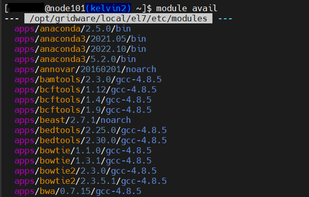

## Modules Enivornment 
Kelvin2 has a large repository of Software installed directly on the system. 
There are multiple versions of different software for users to load into their environment and make use of when running their jobs. 

### <ins>Module avail<ins> 

The `module avail` command will show the list of applications that are currently installed on the central repository.

### <ins>Module load<ins> 

The `module load` command will load the selected module, including its binaries/libraries into the users current environment.

### <ins>Module list<ins> 

The `module list` command will show the currently loaded modules in the users environment.

### <ins>Other module commands<ins> 

- `module unload <module>` - Removes the module from the current environment 
- `module display <module>` -  Shows information about the software

## Jobscripts

The most popular way of running jobs on a HPC cluster is via batch (submitting a jobscript).

- Contains the commands to run your job
- Can contain instructions for the job-scheduler

Below we will outline how to create a jobscript. 

### First steps

To create a jobscript we first must open a text editor, in this example we will us VI. 

To begin, give your jobscript a name:

    vi my_jobscript.sh

At the start of each jobscript you must include the "[shebang](https://linuxhandbook.com/shebang/)":

    #!/bin/bash

### Job scheduler instructions

Once you have given your jobscript a name and added the shebang you can then start to fill it with multiple instructions to pass to the Job Scheduler. 

The most popular of these instructions are :

- Job name
- Output name/location
- Email Notifications
- Resource Request - CPU, Memory, Runtime

Each instruction must come after the identifier `#SBATCH`.

#### Email, Output, Jobname

        #!/bin/bash

        #SBATCH --job-name=new_job    ## this will give your jobscript a name

        #SBATCH --output=/users/<username>/test.output   ##This will be the location and name of your output

        #SBATCH --mail-user=<email@work.com>

        #SBATCH --mail_type=ALL  ##This will set up automatic emails if/when your job begins, ends or fails.

#### Resource request

Default resources when jobs resources are not requested are as follows :

 - 1 CPU Core
 - 1GB of memory per core
 - Max runtime of 3hrs

 If you need more than the default they can request using the instructions below :

        
        #SBATCH --ntasks=<cores>   ## this requests the number of cpu cores needed for the job

        #SBATCH --nodes=<nodes>  ## this requests the maximum number of nodes for cores to be split over

        #SBATCH --mem-per-cpu=<memory>   ## this requests the amount of memory per core needed for the job - can be specified in K (kilobyte), M (Megabyte), G (gigabyte)

        #SBATCH --time=<time>   ## this requests the maximum runtime for a job. (hh:mm:ss)

        #SBATCH --partition=<partitions>   ## This requests the correct partition needed for a job e.g within the correct timeframe or a special purpose node ( GPU or hi-memory)

Paritions

- k2-sandbox – run a quick job to test if script will run (Max runtime - 30 mins).
- k2-hipri - run a job under 3 hours (default)
- k2-medpri - run a job that will run longer than 3 hours but 
less than 24 hours.
- k2-lowpri - run a job that will run longer than 24 hours but 
less than 10 days.
- k2-gpu – run a job on a GPU node (Max runtime - 3 days).
- k2-himem – run a job on a high memory node (Max runtime - 3 days).
- avx512 – run a job on an avx512 enabled node.
- k2-esprc – run a job on esprc nodes (only esprc users).

For further job scheduler instructions please see the [official slurm documentation.](https://slurm.schedmd.com/pdfs/summary.pdf)

#### Full example jobscript

Once you have completed giving your jobscript the correct scheduler instructions you can then move onto loading the correct applications to your environment & running any commands.

Below is a full example jobscript:

        #!/bin/bash

        #SBATCH --job-name=new_job 

        #SBATCH --output=/users/3052732/test.output

        #SBATCH --mail-user=email@work.com

        #SBATCH --mail_type=ALL

        #SBATCH --ntasks=1

        #SBATCH --mem-per-cpu=1G

        #SBATCH --time=02:45:00

        #SBATCH --partition=k2-hipri

        module load apps/python3/3.10.5/gcc-9.3.0

        python3 test_job.py

